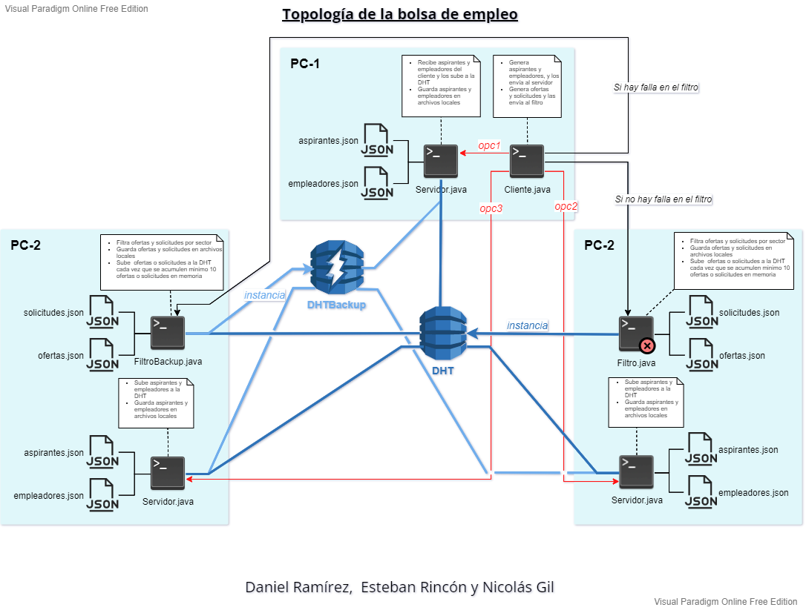

# Proyecto: Bolsa de empleo

## Consideraciones y aclaraciones

* El proyecto fue realizado con el lenguaje de programación Java
* La comunicación entre instancias fue realizada gracias a ZMQ y a la DHT implementada con la ayuda de DKS
* La persistencia se realiza en colecciones de archivos .json que se encuentran locales en cada PC. Existe una colección idéntica por cada máquina de la topología por ende **NADA ESTÁ CENTRALIZADO Y TODO ESTÁ DISTRIBUIDO**.
* Las colecciones de archivos se actualizan cada vez que algo cambia en la DHT
* El proyecto cuenta con las siguentes clases principales:
*   Filtro.java
*   FiltroBackup.java
*   Servidor.java (Se levantan tantas instancias de este programa como servidores se requieran)
*   Cliente.java
> Cada clase principal representa un programa que se corre por línea de comandos y que se tiene que correr con los comandos especificados en la siguente sección

**Compilar todas las clases**: `Colocar comando`

**Correr Filtro.java en el PC-2**: `Colocar comando`

**Correr FiltroBackup.java en el PC-3**: `Colocar comando`

**Correr Servidor.java en el PC-1**: `Colocar comando`

**Correr Servidor.java en el PC-2**: `Colocar comando`

**Correr Servidor.java en el PC-3**: `Colocar comando`

**Correr Cliente.java en el PC-1**: `Colocar comando`

## Topología detallada de la bolsa de empleo

